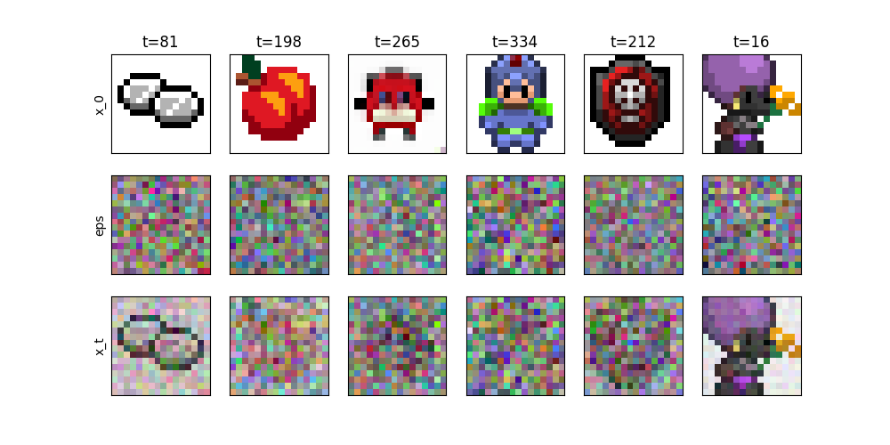
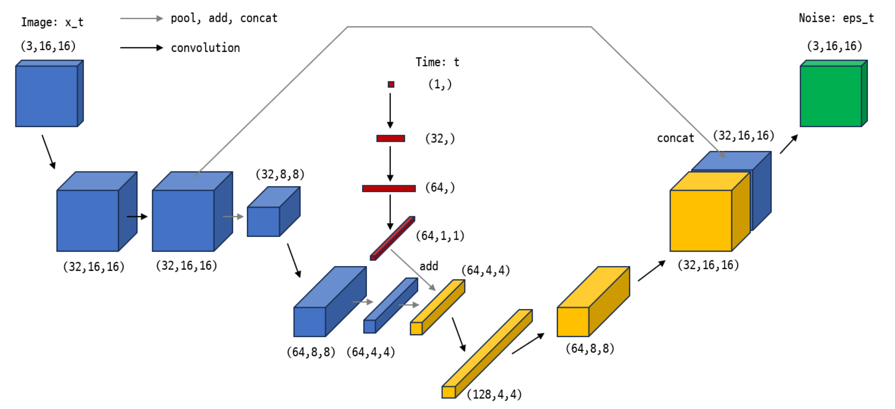

## References:
- https://metamath1.github.io/blog/posts/diffusion/ddpm_part2-2.html

- [How Diffusion Models Work](https://www.deeplearning.ai/short-courses/how-diffusion-models-work/)

- [DDPM tutorial](https://medium.com/mlearning-ai/enerating-images-with-ddpms-a-pytorch-implementation-cef5a2ba8cb1)

- https://www.youtube.com/watch?v=a4Yfz2FxXiY&ab_channel=DeepFindr

- [Diffusion tutorial](https://velog.io/@bismute/Diffusion-Model-%EC%9E%85%EB%AC%B8%ED%95%98%EA%B8%B0)
